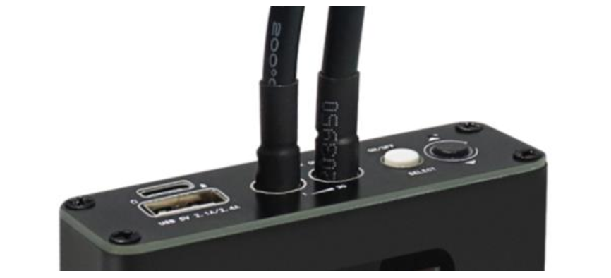
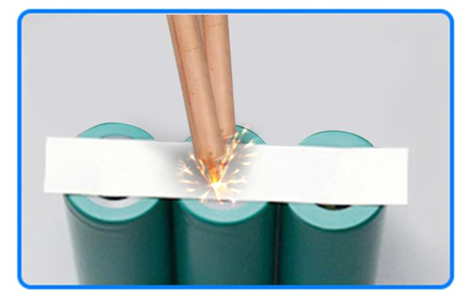
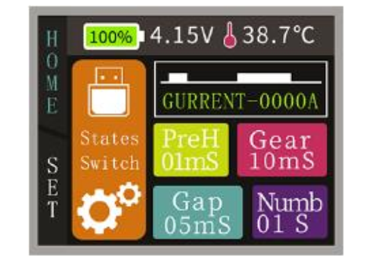
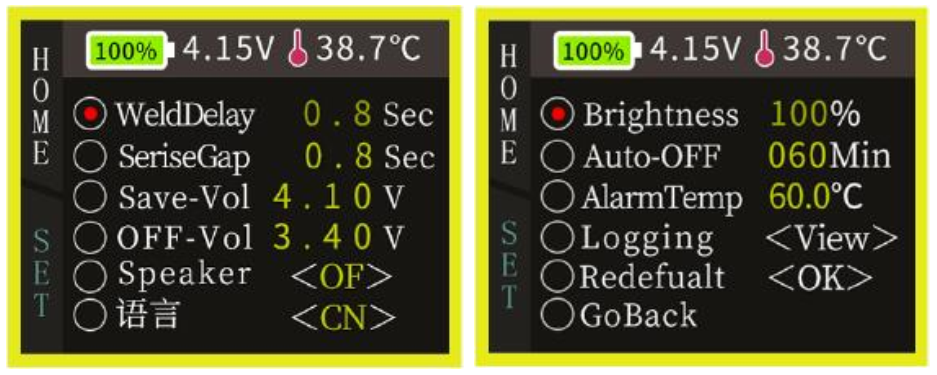

##############################################################################
Tutorial
##############################################################################

How to Use?
*******************************

1. Fully charge the spot welder with the USB cable.

2. Connect 2 welding pens to the spot welder.

3. Long press the white button to power on.

4. Place the nickel strip on the object to be welded.

5. Put 2 welding pens on the nickel strip, and then the it will weld automatically.

.. note::

    You may need to adjust parameters to get the best effect.

6. If the welding effect is not good enough, please adjust the parameters and try again.

**PreH:** Time of preheating.

**Gap:** Time between preheating and welding.

**Gear:** Time of welding.

**Numb:** Number of repeated welding.

**Button description:**

Press the white button to switch to the next option.

Press the black button to change the parameters.

Long press the white button to power on or off.

Press both buttons at the same time to rotate the screen.

Parameter settings reference:

.. table:: 
    :class: freenove-ow

    +---------------+------+------+------+------+
    | Nickel strip* | PreH | Gap  | Gear | Numb |
    +===============+======+======+======+======+
    | 0.1mm         | 2ms  | 2ms  | 5ms  | 1    |
    +---------------+------+------+------+------+
    | 0.12mm        | 2ms  | 2ms  | 10ms | 1    |
    +---------------+------+------+------+------+
    | 0.15mm        | 4ms  | 4ms  | 22ms | 1    |
    +---------------+------+------+------+------+
    | 0.2mm         | 5ms  | 10ms | 28ms | 1    |
    +---------------+------+------+------+------+

* Test with Freeove brand nickel strip (FNK0088).

* The nickel strip comes with this product is 0.12mm.

.. note::
    
    This table is for reference only. It may not be applicable regarding different welding objects, please adjust according to the actual effect.

7. Select the gear icon on the main interface and you can set more parameters

8. Select the USB icon on the main interface and you can also view the power status.

9.  After use, long press the white button to power off
    
Troubleshooting

**Cannot power on:**

* Charge the welder with USB cable.

* Use a thin stick to poke the reset hole.

**Cannot weld:**

* Charge the welder with USB cable.

* Clean residues on the tip of the welding pens
  
Get Support
*****************************

:red:`Having problems?`

Download the latest tutorial and troubleshooting:

http://freenove.com/fnk0087

:red:`Need further help?`

Contact our technical support via email:

support@freenove.com